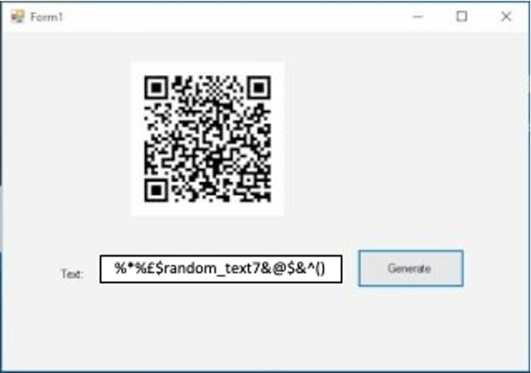

# QR Generator
C# based QR Generator

# Instructions to use the project  
   <li>Use Visual Studio 2010 or Later version to open project</li>
   <li>Go to the solution explorer and right click on project file and click on Manage Nuget Package Manager</li>
   <li>Install "QRCoder" Package</li>
